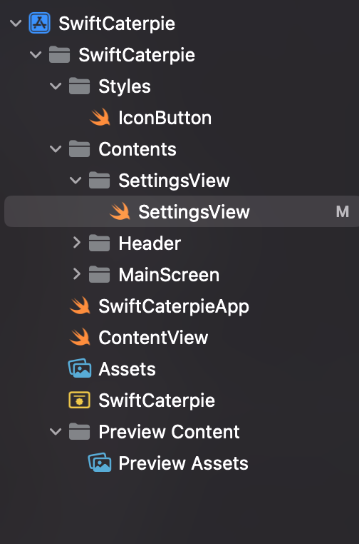
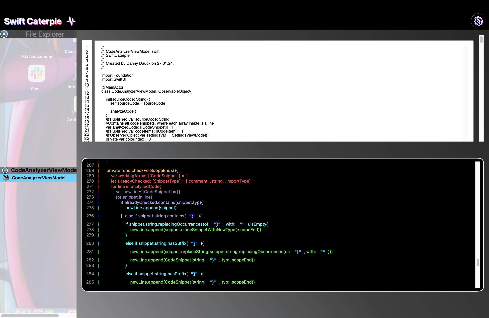
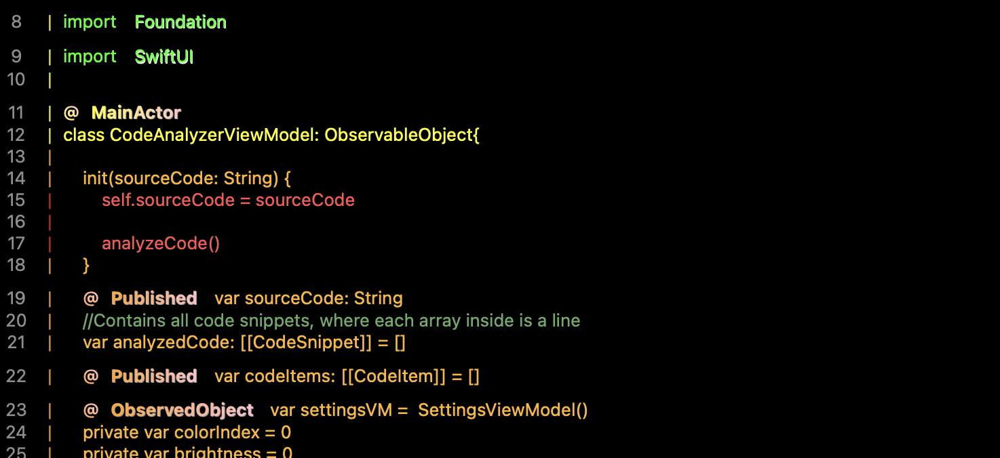

# Swift Caterpie
### Danny Dauck
### About

Swift Caterpie is a Swift development tool in progress. Once completed, it aims to allow you to colorize segments of your Swift code, restructure your code, and incorporate frequently used elements through drag and drop.

---

  
 <b> Development Stages Showcase </b> 

  

    
1.Day

    

      I have created a folder structure to make the project organized, added a header that should always be visible, and implemented an IconButton style designed for system vectors. I aim to represent as many elements as unique icons, such as the 'gear' for settings.
    

    
    
    

  

    I have incorporated a file explorer that recognizes Swift, JSON, PNG, and JPEG files and highlights them accordingly. Here comes the first feature: you can drag and drop multiple projects into the file explorer. This allows you to orient yourself with other projects and compare code sections without having to switch windows. I have also started implementing a Settings Area and filled it with placeholders
    

    
  

  

    
4.Day

    

      Now it starts to work like it should and colorizes the code.
    

    
    

    To get this working I had added some extensions to Color and NSColor and did it another way than I had on mind before.
    

    Now it recognizes some cases more and highlights them. I will improve the logic so I can get some more cases of Code type
    

    
      

  

  

---

